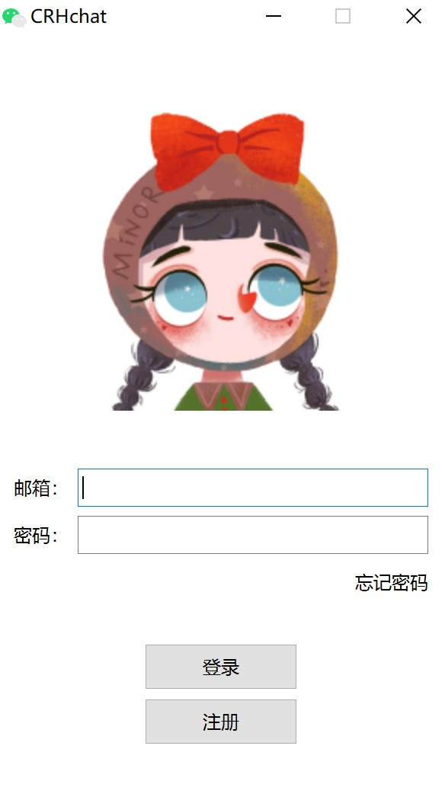
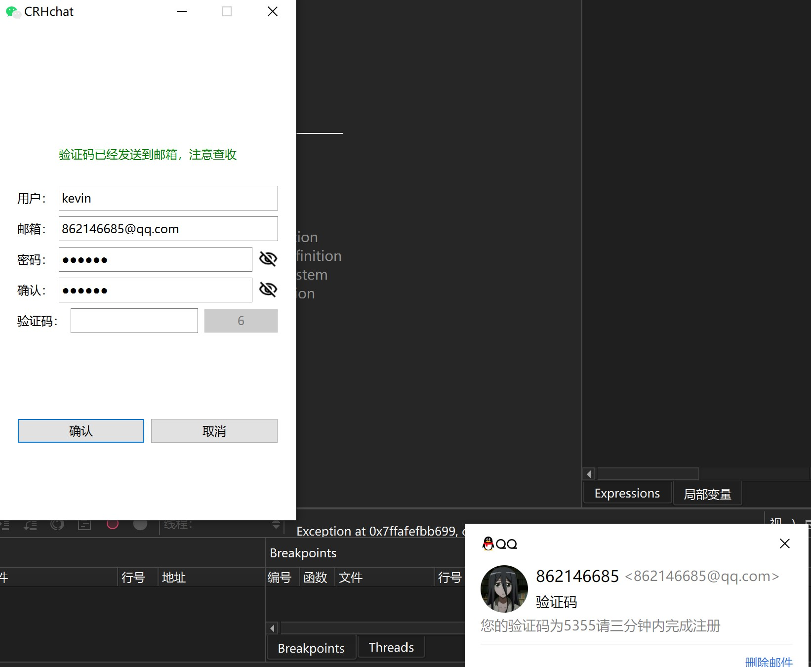
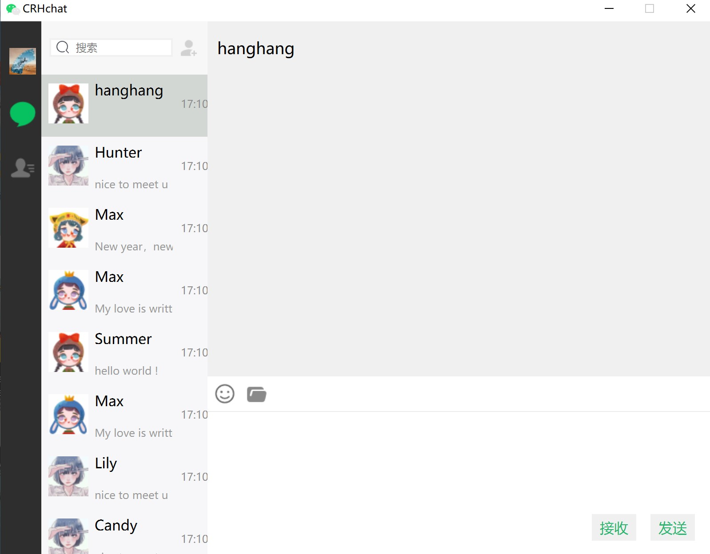
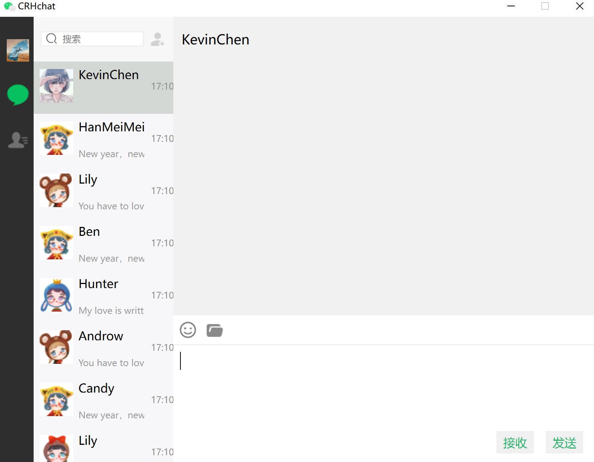
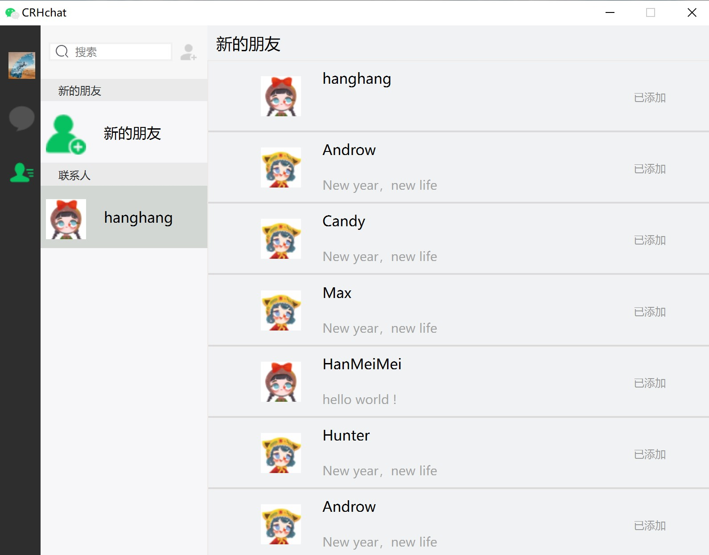
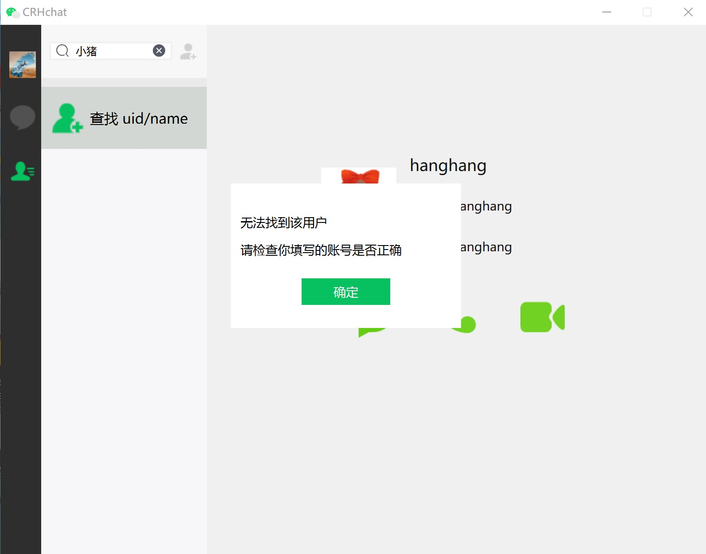
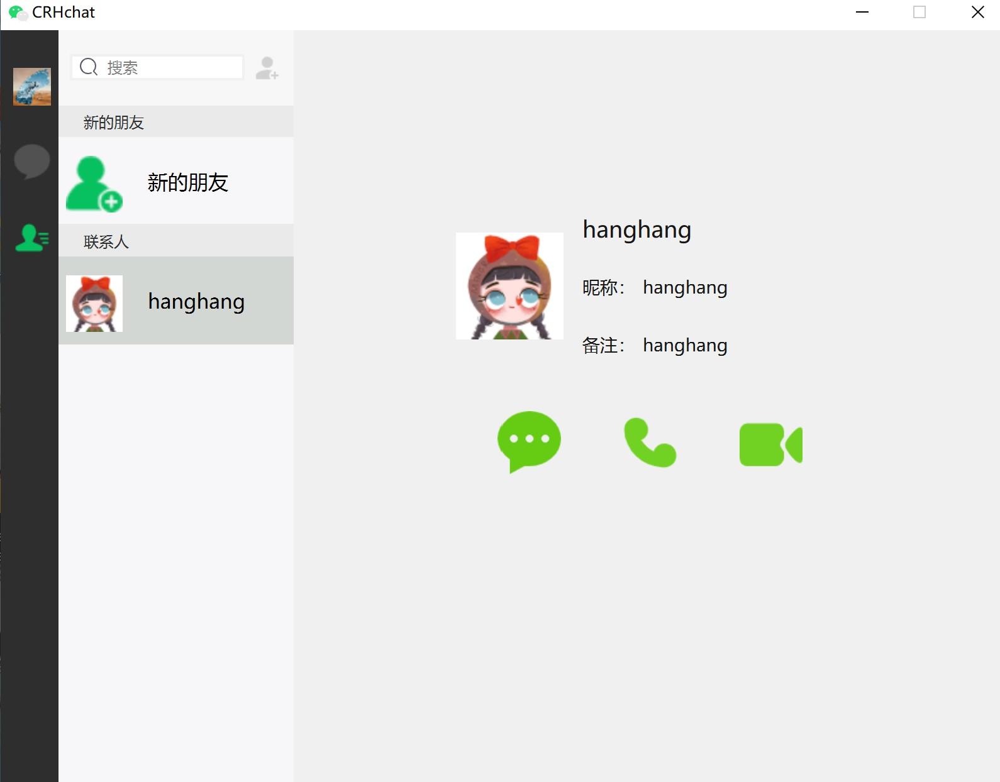
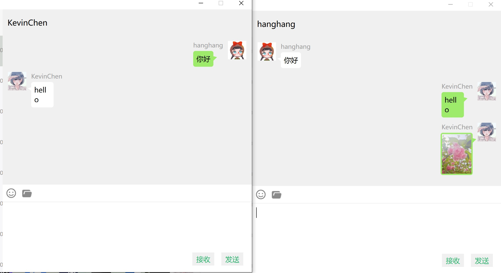

# MiniWeChat
## 项目介绍
这是一个全栈的仿微信即时通讯项目。

前端基于QT实现用户登录、注册、聊天对话、添加好友等界面。利用GridLayout和QPainter封装气泡聊天框组件,通过QListWidget实现好友列表，通过QT network模块封装http和tcp服务。主要支持添加好友，即时通信，聊天记录展示等功能。仿照微信布局并使用qss实现界面美化。


后端采用分布式设计，分为GateServer网关服务器，ChatServer集群聊天服务器，StatusServer状态服务器以及VerifyServer认证服务器。
各服务间通过grpc通信，支持断线重连。GateServer网关对外采用http服务，负责处理用户登录和注册功能。登录时GateServer从StatusServer查询聊天服务，选择负载最少的ChatServer给用户进行即时通讯。ChatServer采用asio实现tcp可靠长连接异步通信和转发，采用IOServicePool多线程模式封装iocontext池提升并发性能。数据存储采用Mysql服务，并封装了sqlconnector的JDBC连接池。此外，还封装了redis连接池处理缓存数据，封装了grpc的stub连接池保证多服务并发访问。

## 项目结构
MiniWeChat/   
├── CRHchat/              # Qt客户端  
│   ├── CRHchat.pro             # 项目文件   
│   ├── res/   #存放资源文件      
│   ├── style/  #存放qss文件    
|   └── ...   #源文件和头文件  
├── Server/             # 服务端  
│   ├── GateServer/     # 网关服务  
│   ├── ChatServer/     # 聊天服务  
│   ├── StatusServer/   # 负载均衡  
│   └── VerifyServer/   # 邮箱验证(Node.js)  
└── Database/           # SQL脚本  

## 环境要求
### 环境依赖
Qt 6.0+

MySQL 8.0+

Redis 6.0+

Visual Studio 2019/2022 (必须包含C++开发组件)

vcpkg 包管理器 (推荐)

MySQL Connector/C++ 8.0

Redis C++客户端 (如hiredis)

通过vcpkg安装依赖库:  
```vcpkg install asio grpc qt5 redis hiredis```

### 为服务器生成VS解决方案
```
# 在项目根目录执行
mkdir build
cd build
cmake .. -G "Visual Studio 17 2022" -A x64 -DCMAKE_TOOLCHAIN_FILE=[vcpkg根目录]/scripts/buildsystems/vcpkg.cmake
```

### 客户端编译运行
```
cd CRHchat && qmake CRHchat.pro
make -j4
./CRHchat
```

## 项目运行展示


<p align="center">图1 登录界面</p>


<p align="center">图2 注册界面</p>


<p align="center">图3 用户KevinChen登录后的聊天界面</p>


<p align="center">图4 用户hanghang登录后的聊天界面</p>


<p align="center">图5 用户KevinChen的联系人界面</p>


<p align="center">图6 查找用户名为小猪的用户，但是由于小猪没有注册，数据库中没有该用户数据，所以显示无法找到该用户</p>


<p align="center">图7 联系人hanghang的个人信息显示</p>


<p align="center">图8 好友之间发送聊天内容，可以看到目前本项目存在的bug，比如英文文本的最后一个字母错误地换行，发出的图片对方无法接收等，这是项目后期需要修复的地方</p>